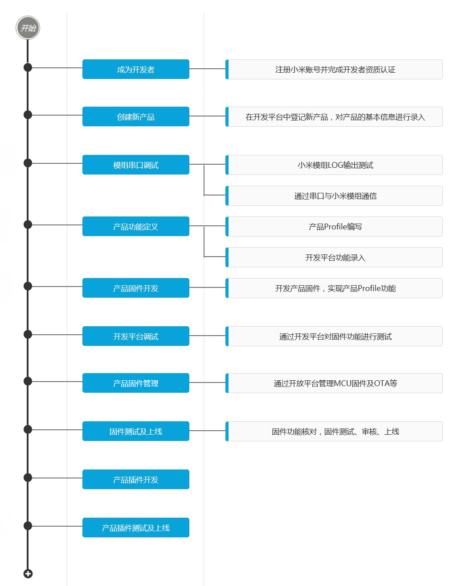
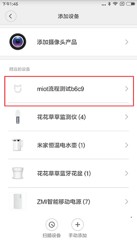

WIFI-模组接入
====================
模组接入方式适合于不具备通讯能力的产品，需要将小米智能模组嵌入现有产品的电路中。

接入流程
----------------


目录
--------------
* [开发准备](#开发准备)
* [模组串口调试](#模组串口调试)
    * [WIFI模组硬件简介](#wifi模组硬件简介)
    * [LOG输出测试](#log输出测试)
    * [串口通信测试](#串口通信测试)
    * [FAQ](#faq)
* [产品功能定义](#产品功能定义)
    * [产品Profile设计](#产品profile设计)
    * [开发平台功能录入](#开发平台功能录入)
* [产品固件开发](#产品固件开发)
    * [模组工作原理](#模组工作原理)
    * [基础串口命令](#基础串口命令)
    * [固件实现方法](#固件实现方法)
* [开发平台调试](#开发平台调试)
    * [设备快连](#设备快连)
    * [固件功能调试](#固件功能调试)
* [产品固件管理](#产品固件管理)
    * [固件平台上传](#固件平台上传)
    * [固件OTA升级](#固件ota升级)
* [固件测试及上线](#固件测试及上线)
* [硬件设计规约](#硬件设计规约)
* [模组采购与设备量产](#模组采购与设备量产)


## 开发准备
首先你需要在[米家智能平台](https://open.home.mi.com/)注册成为开发者。并且使用相同的小米账号，登录[米家APP](http://home.mi.com/index.html)。 

[开放平台>开发引导](https://open.home.mi.com/guide.html#/id=2/)中介绍了一些基本概念，请务必提前阅读。  

在开始调试之前，你需要确定产品接入方式，并在开放平台里面申请一个新产品，审批通过后，获得产品的model。（由于ssid不能超过32字节，model将限制为23个字节以内）  

**注意：申请产品所使用的开发者账号，应使用企业开发公用的小米账号申请成为企业开发者，即使用公司开发公用手机号码、邮箱注册的小米账号。**

## 模组串口调试

### WIFI模组硬件简介

#### 小米MHCW03P模组开发板

外观图：


管脚图：


原理图：


#### 小米MHCWB2P模组开发板外观：

外观图：


管脚图：


### LOG输出测试

- MHCW03P模组LOG输出口  **74880 8N1**
- MHCWB2P模组LOG输出口  **115200 8N1**
- 我们可以通过这个口看到模组工作状态。
- 模组上电后，可以看到一个典型的LOG输出，包含固件版本 *firmware*， 设备DID *digital_did*， MAC地址*mac address* 等。  


```
_|      _|  _|_|_|  _|_|_|    _|_|
_|_|  _|_|    _|      _|    _|    _|
_|  _|  _|    _|      _|    _|    _|
_|      _|    _|      _|    _|    _|
_|      _|  _|_|_|  _|_|_|    _|_|  

OTP read OK
JENKINS BUILD NUMBER: N/A
BUILD TIME: N/A
BUILT BY: N/A
firmware: 1.2.5
MIIO APP VER: N/A
MIIO MCU VER: N/A
ESP SDK VER: 1.3.0(2ecfb74)
digital_did is 12593364
mac address is f0b42905b742

```

### 串口通信测试

- 你只需要通过串口(**115200 8N1**)即可与小米模组进行通信，如图：


- 通过SecureCRT工具打开串口，输入help既可以得到支持的串口命令列表，此时证明串口工作正常。


### FAQ

- Q：模组无法启动，没有打印内容或者打印内容非常少，发现不了AP怎么回事？
- A：请检查连接线路是否OK，并确认GPIO0是否被拉低进入烧录模式或者GPIO15被拉高无法正常启动。如果还有问题，请咨询开发人员。
- Q：启动时在串口打印的乱码是怎们回事？  
- A：启动时打印的乱码为乐鑫模组boot段代码，波特率为74880，8,1,N,N。串口转USB工具请不要使用PL2303，推荐CP2102,串口工具minicom中波特率可能无法更改，推荐SecureCRT。确定VCC接入电压稳定性。
- Q：通信串口输入help后无反应是怎么回事？
- A：可尝试输入“echo on”打开回显，如果返回“ok”则证明通信正常，可再次输入help获取命令列表。通过串口工具通信时，建议打开回显功能，方便查看。
```
>echo on
<ok
```

## 产品功能定义

功能定义描述了产品具有的功能，在产品固件中需要对这些功能进行实现，在产品上线前，小米会对固件功能进行核对。我们建议在功能实现前先录入平台，并允许进行修改、删除，以满足开发过程中各部分的一异步开发需求。  

**开始之前确保你已经阅读了[开放平台>开发引导](https://open.home.mi.com/guide.html#/id=4/) 中关于产品功能定义的相关介绍。**

### 产品Profile设计

产品Profile，即为对产品功能抽象化，将**属性、方法、事件**三部分功能以接口实现方式进行描述。  

**请参考示例 [空气净化器举例](../md_images/设备profile模板-空气净化器举例.pdf)**

可以按照示例文档对你的产品功能进行梳理。

#### 关于[JSON RPC](http://json-rpc.org/wiki/specification)

当通过云端与设备通信进行调试时，指令将以JSON字符串的形式出现。相关调用规范和返回值请参考：[指令调用规范.pdf](http://orig.static.home.mi.com/docs/%E6%8C%87%E4%BB%A4%E8%B0%83%E7%94%A8%E8%A7%84%E8%8C%83.pdf)  

变量，函数的命令风格遵循[GNU-C](https://www.gnu.org/prep/standards/)风格，小写字母，下划线分隔就可以了。（天呐不要驼峰式...）

### 开发平台功能录入

你需要将产品功能录入到开发平台中，可在开发平台>产品管理中点击对应产品的“开发”按钮进入该产品管理界面。

在功能示例中可以尝试如何编辑功能，并作为参考，但仅作为示例，不能保存为自有功能。  

在自有功能界面中可以对你的产品的功能进行录入。  

在公共功能界面中，显示了当前产品管已关联的公共service，其中部分功能无需开发者实现，部分功能为建议开发者实现。（例如：get_prop为开发者必须实现的方法，需编辑到产品自有功能中。  
  

## 产品固件开发

### 模组工作原理

MIIO芯片提供一套可读的串口文本命令，供外部芯片调用，一般适用于MIIO模块不是主控芯片的情况，即MIIO芯片只负责网络通讯，而不关心业务逻辑。  

文本命令采用“一问一答”的方式，每条命令，无论执行成功与否，都会返回结果或错误提示。  
下文中，示例里的“↑”和“↓”分别代表命令和结果。有时，也称二者为“上行”信息和“下行”信息。因为在涉及到云通信的命令里，“上”代表发往云端，“下”代表从云端发来。

一个典型的上行例子（温度传感器上报温度）：

1. 传感器探知当前温度为26度
2. 传感器调用MIIO芯片的props命令，通过MIIO芯片向云端上报温度属性：props temp 26

一个典型的下行例子（手机app打开电源开关）：

1. 手机app发出打开开关指令
2. MIIO芯片接收到app的下行消息，并翻译为文本命令：power_on
3. 主控MCU不停的使用get\_down命令轮询MIIO芯片，得到了power_on命令
4. 主控MCU完成电源打开的操作
5. 主控MCU调用result ”ok“，告知MIIO芯片成功完成
6. MIIO芯片回复ok，告知结果已收到

### 基础串口命令

#### get_down

- 循环获取wifi芯片透传的指令。此命令应该在主循环内循环调用，建议80~200ms间隔。

- 参数：无

- 返回：down <method_name> <arg1>,<arg2>,<arg3> ...

- 说明：获取下行指令。如果有下行方法，则返回该方法，如没有，则返回none。如果对上一个方法还没有给出结果，则返回error。MCU在获得下行方法后，有1s时间处理，并用result/error命令上传结果。超过1s后，则wifi模块认为调用失败。

- 返回值说明：如果没有下行命令，则返回down none 如果有下行命令，则返回命令名、命令参数（如果有参数）。命令名和参数之间用空格隔开，多个参数之间用逗号隔开。参数可以是双引号括起的字符串，或是数字。

- 举例：
```
↑get_down 
↓down none
↑get_down 
↓down power_on "light_on",60,0,1 
↑result "ok" 
↓ok 
↑get_down 
↓down power_off 
↑get_down 
↓error
```
- 你需要实现一个 down get_prop方法，这样云端或者APP就可以实时查询你设备的属性状态，通常在刷新APP界面的时候很有用。


#### props

- 属性上报

- 参数：<prop_name_1> <value_1> <prop_name_2> <value_2> ...

- 返回：ok 或 error

- 说明：参数至少要有一个名值对。

- 举例：

```
↑props temp 21 hum 50 location "home" 
↓ok 
↑props location office (格式非法)
↓error
```
- 限制：属性名的字符个数不得多于31个（可等于31）

#### event

- 事件上报

- 参数：<event_name> <value_1> <value_2> ...

- 返回：ok 或 error

- 说明：发送上行事件。

- 举例：

```
↑event overheat 170 
↓ok 
↑event button_pressed 
↓ok 
↑event fault "motor stuck" "sensor error"
↓ok 
↑event fault motor stuck (格式非法) 
↓error 
↑event fault "motor stuck" 
↓ok ... (短时间内大量event） 
↑event fault "motor stuck" （此时，事件队列已满） 
↓error
```
- 限制：

1. 事件名的字符个数不得多于31个（可等于31）

2. 如果MIIO芯片断网，事件会在芯片里缓存最长10分钟，如果这段时间内网络未恢复正常，则事件会被丢弃

3. MIIO芯片最多缓存8条事件，如果短时间内大量调用event命令，则会造成缓存列表填满，后续事件会被丢弃


#### model

- 参数：无 或 <model_name_string>

- 返回：无参数时，返回当前model字符串。带参数时，将芯片model设为参数字符串，并返回ok。如果参数字符串不合法，则返回error。

- 说明：合法的model字符串有3部分构成：公司名、产品类别名、产品版本。3部分以“.”连接，总长度最多为22个字符。

- 举例：
```
↑model 
↓xiaomi.dev.v1 
↑model xiaomi.prod.v2
↓ok 
↑model 
↓xiaomi.prod.v2 
↑model company.product_name_that_is_too_long.v2 
↓error 
↑model plug 
↓error
```

#### mcu_version

- 参数：<mcu_version_string>

- 返回：如果参数合法，则返回ok，非法则返回error

- 说明：上报MCU固件版本。要求必须是4位数字。MCU应该在应用固件引导后，第一时间调用该命令上报版本。另外，如果下行命令收到MIIO_mcu_version_req，也应该立即上报版本。

- 举例：
```
↑mcu_version 0001 
↓ok 
↑mcu_version A001 
↓error 
↑mcu_version 1
↓error
```

#### version

- 参数：无

- 返回：版本号，当前为2

- 说明：串口协议（本协议）的版本

- 举例：
```
↑version 
↓2
```

#### reboot

- 参数：无

- 返回：ok

- 说明：MIIO接收到该命令后，将在0.5秒内重启。

- 举例：
```
↑reboot
↓ok
```

#### restore

- 参数：无

- 返回：ok

- 说明：MIIO接收到该命令后，将清除wifi配置信息，并在0.5秒内重启。

- 举例：
```
↑restore 
↓ok
```

#### factory

- 参数：无

- 返回：ok

- 说明：MIIO芯片收到该命令后，在0.5秒内重启，并进入厂测模式。该模式下，芯片会按照预设置信息连接路由器。预设路由器SSID：miio_default，密码：0x82562647

- 举例：
```
↑factory 
↓ok
```

**以上为模组工作必需指令，需要开发者在固件中进行实现。**  

#### 更多串口命令介绍见[串口命令](../md_images/new/MIIO芯片串口命令详情.pdf)


### 固件实现方法

正常工作情况下，设备MCU通过串口与模组进行通信，模组向云端发送或获取信息。  

**MCU上电后，需要先使用“model”，“mcu_version”设置model，固件版本号。**  

模组正常工作模式为：

1. 主控MCU向模组循环发送“get\_down”指令，以轮询模式，从模组处获取云端下发的指令。（建议get_down指令循环周期为100~400ms）
2. 若模组回复“down none”，则暂无需要完成的命令，继续使用“get_down”命令轮询模组。
3. 若模组回复具体指令，根据获取的下行指令，完成相应操作。
4. MCU对于模组的各项操作，均需使用相应串口指令，通过串口与模组通信。
5. 指令执行后，调用“result”命令向模组发送命令执行结果。模组芯片回复“ok”表示结果已收到。
6. 建议以一定时间间隔循环使用“props”指令上报当前属性值。
7. 当有设定事件（Event）发生时，通过“event”指令上报事件。


## 开发平台调试

### 设备快连
开始前请确定你已经在开放平台上完成[开发准备](#开发准备)，并且新建产品审核通过。  

你可以在MCU上电后，**设置产品的model**。（例：产品model为miot.dev.v111）
```
>model miot.dev.v111
<ok
```
打开智能家庭APP，按照提示绑定设备到**开发者账号**。（设置model后，设备名称显示为该产品名称。）




此时设备已连入你的账号，然后回到开放平台，你就可以向模组发送RPC命令了。

### 固件功能调试

设备连入账号后，你可以在开发平台>功能调试中看到该设备。  
  
  
在1处选择测试功能，测试方法和对应指令，并可在2处修改指令。3处发送指令，并可点击“功能定义”进入功能编辑界面。  

通过测试功能及方法选择，可以逐条测试固件对于功能的实现情况。  

miIO.info是一个基本命令，你随时都可以向设备发送，查询设备的基本信息


## 产品固件管理

### 固件平台上传

产品固件完成后，需要在开发平台上进行上传，并**关联该版本固件完成的功能**，以进行功能核对。  
  

#### 固件上传与CRC验证

MCU固件需要尾部添加CRC后再上传，你可以使用我们提供的[工具](../md_images/crc32)自行添加（甚至可以集成到你的编译脚本里面）。  
  

上传时请认真填写固件信息，其中MCU版本号格式为**四位数字**。


#### 版本号上报

MCU上电后，设置产品的mcu_version。 

```
>mcu_version 1000
<ok
```

### 固件OTA升级

#### 升级流程说明

在MIIO芯片加主控MCU的串口方案中，MIIO芯片通过串口向MCU提供升级功能。升级功能由文本命令触发，并完成握手。数据传输使用了Xmodem协议，以数据全文校验通过表示成功结束，以超时退出表示失败。数据传输中文本命令暂停响应。为完成固件升级任务，MCU需实现如下功能：

1. MCU的应用固件必须能够识别升级命令，重启进入bootloader
2. bootloader必须能够完成握手过程
3. bootloader必须支持Xmodem数据接收，数据块大小为128B
4. bootloader必须支持Xmodem数据两种校验中的至少一种：校验和 或 CRC
5. MCU应用固件必须能够在适当时候通过mcu_version命令告知当前固件版本号，一般是一开始
6. 当MCU接收了不完整的数据（如中途断电），重启后bootloader应该能够发现，并停留在bootloader里的升级握手流程里
7. 为保证能够从错误中恢复，bootloader应该实现一个固定时长的握手窗口（详见下面）

| 步骤 | MIIO芯片 | 用户MCU |
|------|----------|---------|
|1|MIIO芯片接到来自网络的升级命令，开始下载用户MCU固件文件到缓冲区，下载完成并交验通过。|     |	 
|2|关闭除升级所需之外的所有文本命令。所剩可执行命令为：get\_down,result.对其他所有命令调用都返回error|  ↑get\_down↓down update_fw  ↑result “ready” ↓ok|
|3|收到result “ready”后，进入Xmodem模式|收到ok后，进入Xmodem模式|
|4|Xmodem传输|Xmodem接收|
|5|传输完成，退出Xmodem模式，重新打开所有文本命令，擦除下载缓冲区里的固件|接收完成，校验通过，重启。|
|6|    |用mcu_version报告新版本号|

注意：
1. MIIO模组通过http连接下载固件，同MCU通过Xmodem协议进行数据传输。 
2. 传输数据包为128B，加上Header,Packet Number,CherckSum共计134字节。 
3. 传输最后一个包时，如果有效数据不足128B，则补齐为1A FF FF FF…若128B,则补加一个数据包，数据为1A FF FF
4. Xmodem传输数据握手时，第一个NAK或C用于确定校验方式，第二个NAK或C开始传输数据。因此超时时间不宜过长。 


#### 对升级中意外断电的处理

如果升级握手不成功或者在Xmodem传输中意外断电，则MCU没有接收到完整地固件，需要重新传输。在上表中，MIIO下载的MCU固件会有相应的头部标识，通过头部标识可以区分固件种类（wifi固件、app固件或mcu固件），在传输成功后即擦除缓冲区中的头部标识。如果握手不成功或Xmodem传输中意外断电，MIIO没有擦除头部，在上电重启后检测缓冲区中的头部和crc，如果mcu固件的头部和crc校验通过则在MCU bootloader里预留的一个刚上电后的时间窗口里，和MCU握手，使其进入升级流程。为使该机制有效，做如下约定：

1. MIIO模块与MCU必须同时上电
2. MIIO模块和MCU上电后，完成最基本的初始化后（要求时间很短，100ms内），进入握手时间窗口，窗口持续1s
3. MIIO模块在窗口内首先校验下载缓冲区里的MCU固件，包括头信息、CRC，如果校验通过，则进入握手等待
4. MCU在窗口内，一直快速（间隔小于100ms）向MIIO模块发送get\_down，并检查是否有down update_fw

#### xmodem协议

你可以下载[xmodem源代码](../md_images/xmodem.c)，然后集成到你的主控MCU当中。  

*如果你使用的是Atmel系列的mcu，可以联系我们(miot-open@xiaomi.com)提供例程*

#### 通过开放平台调试

编译好固件，添加CRC32，上传，获取固件的url后，你可以向设备发送如下命令来启动MCU OTA过程：

```
{"method":"miIO.ota","params": {"mcu_url":"xxxxxxx"},"id":1}
```


## 固件测试及上线

固件开发完成后，在开发平台中进行上传并关联此版本固件已实现的功能，你就可以开始进行测试了。  


白名单测试时，**只有该产品白名单成员可进行测试**，请确定测试成员均在白名单范围中。  

测试完成后，申请上线，等待审核。

## 硬件设计规约

在跑通以上软件以后，相信你已经有信心准备投板生产的你设备了。在开始之前，你需要了解一些通用的设计规约

### WIFI指示灯

你需要自己定义自己的WIFI重置按键与WIFI指示灯。小米产品指示灯规范如下：

```
双色LED灯方案【强烈建议】
橙色指示灯和蓝色指示灯
状态          双色LED闪烁方式
等待快连中     橙灯闪烁（橙0.1s 灭0.2s）
快连中、连网中、路由器掉线重连中    蓝灯闪烁。（蓝0.1s 灭0.2s）
成功连接到路由器、云端掉线      蓝灯慢闪 (optional) (蓝0.2s 灭0.8s) 或 蓝灯常亮
成功连接到云端      蓝灯常亮
升级中     橙灯慢闪。（橙0.2s 灭0.8s）
```

注： 成功连接到路由器与成功连接到云端通常时间很短，可以选择性区分。

```
单色LED灯方案【迫不得已】
颜色不指定，可根据外观选择
状态	双色LED闪烁方式
等待快连中	慢闪（亮0.2s灭0.8s）
快连中、连网中、掉线重连中	快闪（亮0.1s灭0.2s）
成功连接到路由器	长亮
成功连接到云端	长亮
升级中	双闪（亮0.1s灭0.2s亮0.1s灭0.8s）
```

通过net命令可以查询到网络连接状态

```
>net
<uap
```

### WIFI重置

WLAN重置是指断开当前WLAN连接，使芯片重启后处在等待块连的状态中的操作。MIIO设计规约要求必须预留一个复位按钮，按钮可以设计为以下两种中的一种：

1. 单独的隐藏按钮（类似路由器的复位孔）

2. 与其他按键复用

按钮被长按5秒后，触发设备WLAN重置操作。

通过串口命令可以重置WIFI连接，解绑用户账号的关系

```
>restore
<ok
```

### 进入测试模式

为产品整机预留一个进入测试模式的方法，可以帮助快速进行产线上的联网。也可以在用户遇到联网困难时，提供最后的解决办法。  

例如：按住开关键上电，并保持5s以上，发送串口命令。厂测模式的热点名为 miio_default ，密码 0x82562647

```
>factory
<ok
```

### 低功耗模式唤醒管脚

MIIO模组在空闲时会进入低功耗模式。设计上，可以用一个管脚与MIIO模组的唤醒管脚相连，当MCU需要MIIO立即响应时，把这个管脚拉低即可。

### 串口焊孔、焊盘  

为方便调试，应该在PCB主板上留有如下过孔：

1. WIFI模块的UART0 RX/TX/GND，供输出WIFI模块的调试信息。
 
2. WIFI模块的UART1 RX/TX/GND，供查看WIFI模块与MCU之间的通信。
 
3. WIFI模块的boot pin/GND，boot pin拉低上电，WIFI模块进入串口烧写模式。

4. pin与GND做成可被跳线短接的相邻过孔

5. MCU的调试输出，如果MCU提供了运行时的调试输出，应该提供相应的过孔
 

### 贴片位置
PCB天线需要外露，附近1CM需要净空。天线下方不要有PCB板（如开发板所示）。整机组装后天线尽量靠近外壳面板，不要被大块金属遮挡（如电机、水箱之类）

### 底板参考设计


参考：[MHCW03P_bottom.dxf](./MHCW03P/MHCW03P_bottom.dxf)

### 按钮操作的上报
产品的任何实体按钮，在被按下时，可以用prop命令将这一操作作为属性上报给wifi芯片。button_pressed是一个保留的属性，在产品量产后能知道用户如何操作了你的设备，通常对售后很有帮助。

```
>props button_pressed "power"
<ok
```

## 模组采购与设备量产

当你准备量产你的产品，需要采购模组时，需要签订采购框架协议与NDA协议。我们同时会提供模组的规格书、报价单、SRRC认证报告、ROHS等认证报告。发邮件到miot-open@xiaomi.com ，我们会有专人与你联系。 关于[来料检验与开机检查](./testing.md)


[返回目录](#目录)


